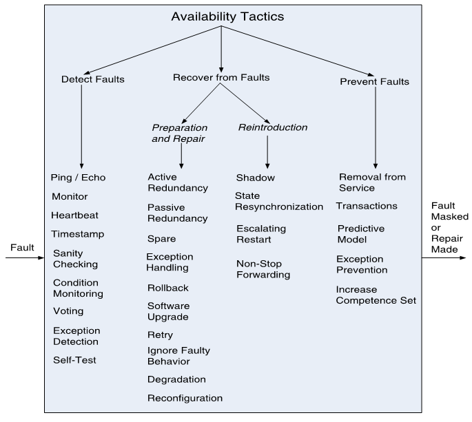
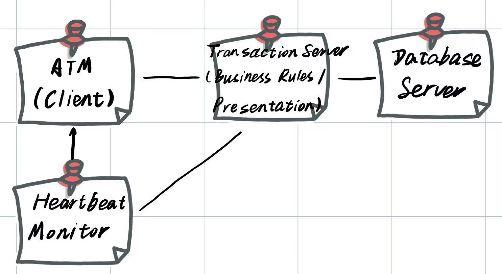
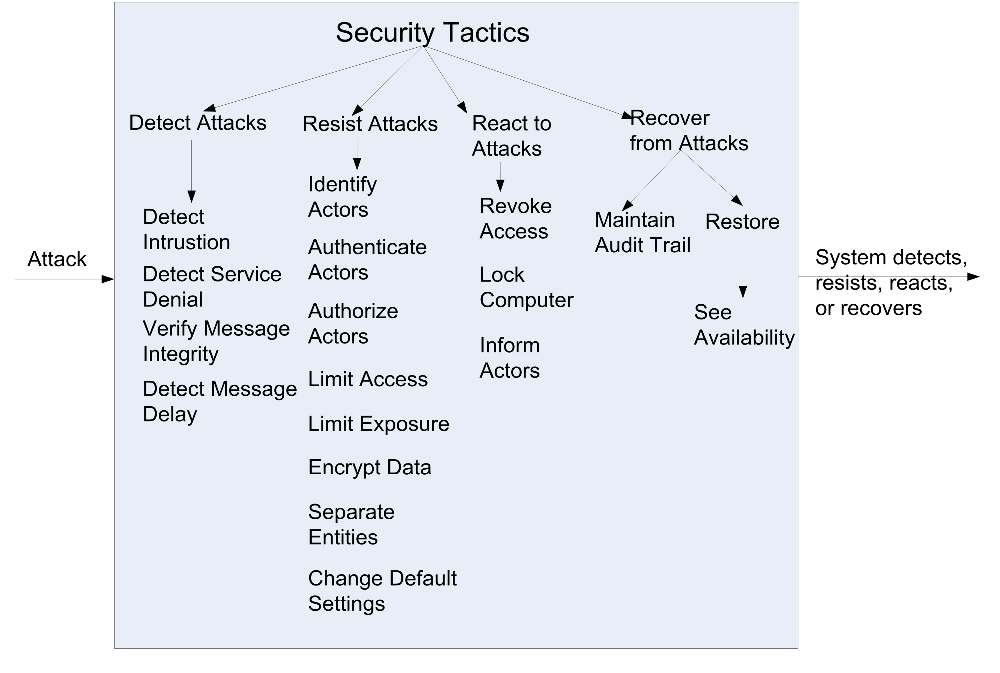
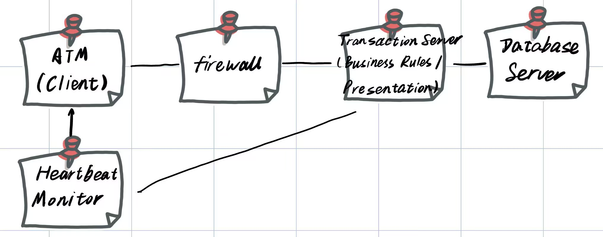

# Exercise 2

- Based on the ASRs from your own Utility Tree, create a design fragment using the ADD method employing and instantiating a pattern.
- Submission:
  - Deadline:   April 21st
  - Place: submit to Blackboard

## My answer

### round 1: Availability

Choose **Heartbeat Monitor**

### round 2: Security

Choose **firewall**.

