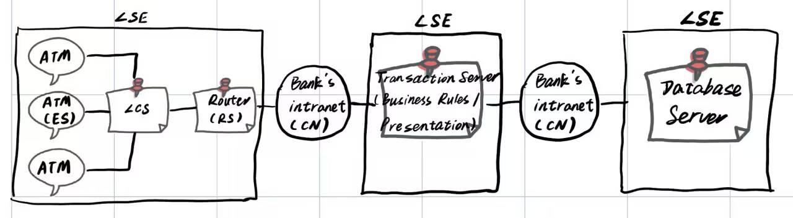
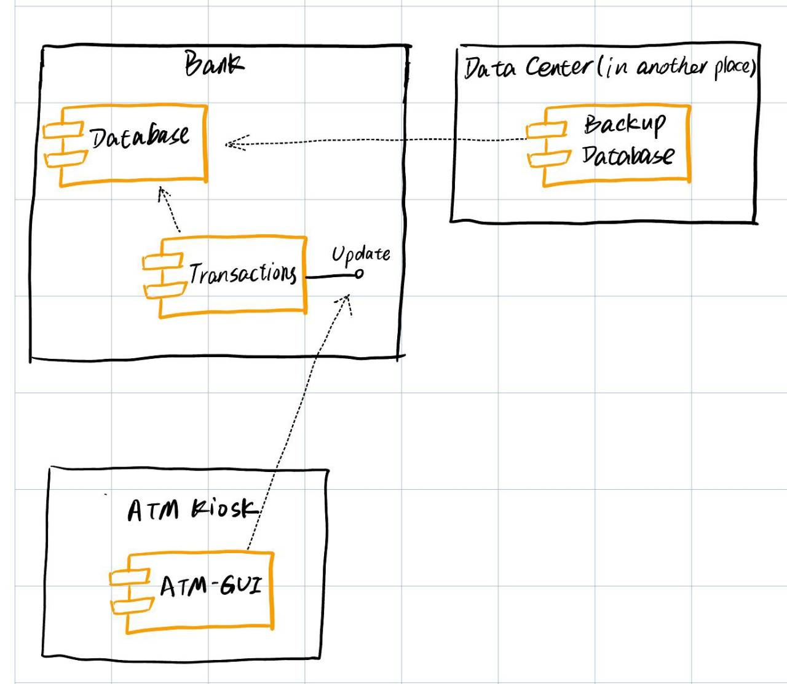

# Exercise 3

- Develop 2 more views for our ATM system.

- For each view describe **who and when will need** to use this view.

- Submission:
  - Deadline:   April 21st
  - Place: submit to Blackboard

## My answer

1. Quality View - Security view

This view is developed for security engineers of the system. The security engineers will check and deal with the problems or attacks relevant to this system.

- Local Subscriber Environment (LSE)
- End System (ES)
- Relay System (RS) - The component of an LSE, the functionality of which is limited to information transfer and is only indirectly accessible by users (e.g., router, switch, multiplexor, message transfer agent). It may have functionality similar to an end system, but an end user does not use it directly. Note that relay system functions may be provided in an end system.
- Local Communication System (LCS) - A network that provides communications capabilities between LSEs or within a LSE with all of the components under control of a LSE.
- Communication Network (CN) - A network that provides inter-LSE communications capabilities, but is not controlled by LSEs (e.g., commercial carriers).

Reference: http://www.opengroup.org/public/arch/p4/views/vus_sec.htm

---

2. Deployment View

This view is developed for both security engineers and maintainers of the system. This view can be used to reason about performance and availability of the system.

