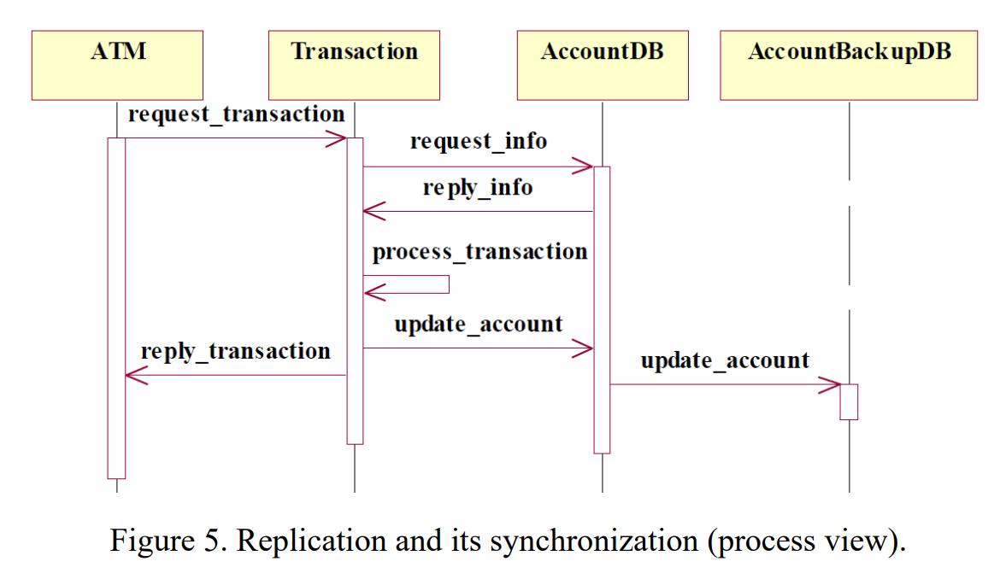

# Exercise 4

- Submit the results of your discussion on Activity 2 as Homework 4
  - Activity 2: See the worksheet for the description of the system and evaluate the architectural design decisions with sensitivity points, trade-off points and the risk points

- Submission:

  - Deadline: April 21st

  - Place: submit to Blackboard

## Reference

We started this discussion in class and gave examples as well. You just need to think about a dew more sensitivity and trade-off points, based on the design described in a worksheet. Here is the example we gave for the simple design we discussed in class:

“This system instantiates Client-Server pattern. The benefits of this pattern are that it is easy to add clients and the servers may be replicated to support scalability and modifiability. However it also has disadvantages. The server can be a performance bottleneck and a single point of failure. In addition, decisions about where to locate functionality are often complex and costly to change after a system is build, which impacts modifiability.

Sensitivity point: Server can be a performance bottleneck and a single point of failure

Trade-off: Improves scalability and modifiability but decreases performance”.

## Summary and example in slide

The slide 'evaluating_architecture' tells the basic info of ATAM (Architecture Tradeoff Analysis Method), including phases of the ATAM. However, the further details of phases of the ATAM are mentioned in the slide of exercise 4.

We have done steps 1-5 previously — we created a **utility tree**, while steps 7-9 are evaluation.

6 Analyze Architectural Approaches

7 Brainstorm and Prioritize Scenarios

8 Analyze Architectural Approaches (performs the same activities as in step 6)

The most improtant step is **step 6**: We need to find **risk points, sensitivity points and trade-off points**.

- risk point:
  - Architectural decision that may lead to undesirable consequences in light of stated quality attribute requirements

    根据规定的质量属性需求，可能导致不良后果的架构决策

  - Architecturally important decisions that have not been made

    尚未做出的架构上的重要决策

    - Example: the architecture team has not decided what scheduling discipline they will use, or has not decided whether they will use a relational or object oriented database

      架构团队还没有决定他们将使用什么调度规则，或者还没有决定他们将使用关系数据库还是面向对象数据库

  - Or decisions that have been made but whose consequences are not fully understood

    或者已经做出的决定，但其后果尚未完全了解

    - Example: the architecture team has decided to include an operating system portability layer, but are not sure what functions need to go into this layer

      架构团队决定包含一个操作系统可移植性层，但不确定该层需要包含哪些功能

  - Example: The frequency of heartbeats affects the time in which the system can detect a failed component.  Some assignments will result in unacceptable values of this response.
  
    心跳的频率影响系统检测故障组件的时间。有些任务将导致该响应的不可接受值。
  
- sensitivity points:

  - Architectural decisions that have a marked effect on one or more quality attributes.
  - Areas of the system that will be significantly impacted if system architecture is changed.
  - Parameters in the architecture to which some measurable quality attribute response is highly correlated.

- trade-off points:
  - Dependencies between attributes
  - A trade-off point is found in the architecture when a parameter of an architectural construct is host to more than one sensitivity point where the measurable quality attributes are affected differently by changing that parameter.
  - A *trade-off point* is a property that affects more than one attribute and is a sensitivity point for more than one attribute.

---

Use our ATM system as an example. It uses client - server structure, and the ASRs are **modifiability and performance**, the following are examples:

Modifiability scenario: A developer wishes to add a new auditing business rule at design time and makes the modification, without affecting other functionality, in 10 person-days.

Performance scenario: The user can withdraw a limit of $300 from an account that has sufficient funds in less than 10 seconds.

So review the knowledge of modifiability and performance, and then **evaluate Three-tier client-server model**.

- Advantages
  - Easy to add clients
  - Servers may be replicated to support scalability and modifiability
- Disadvantages
  - Servers can be a performance bottleneck
  - A single point of failure

So the risk points, sensitivity points and trade-off points can be:

- Sensitivity point
  - Server can be a performance bottleneck and a single point of failure
- Trade-off point
  - Improves scalability and modifiability but decreases performance
- Risk point
  - Architecturally important decisions that have not been made. The architecture team has not decided what **security tactics** they will use. (Another ASR about security!)

## My answer

The chosen ASRs are **availability and performance**, the following are examples:

Availability scenario: Keep running with no downtime. The ATM network has to be available 24 hours a day.

Performance scenario: The user can withdraw a limit of $300 from an account that has sufficient funds in less than 10 seconds.

Review the knowledge of availability and performance, then evaluate this model that has a **backup database**.

*In this step, there is no need to concern about the difference between active redundancy (hot spare), spare (cold spare) and passive redundancy (warm spare).*

- Advantages
  - Easy to rollback

- Disadvantages
  - Decreases performance

So the risk points, sensitivity points and trade-off points can be:

- Sensitivity point
  - **AccountDB** can be a performance bottleneck and a single point of failure
- Trade-off point
  - Improves availability, but decreases performance
- Risk point
  - It is important to choose one kind of spare strategies: hot spare, cold spare and warm spare, because the trade-off can only be measured after this choose.

## 中文简单小结

完成 ATAM 的流程 1-5 步是画 Utility Tree，第六步是重点，为了找到 Sensitivity point、Trade-off point 和 Risk point，我们会这样做：

1. 找到两个可能有权衡点（也即矛盾）的 QA，然后抽出 ASR
2. 与此同时，发生权衡的系统的部件（或者说设计）也拿出来分析
3. 该种设计可能是某种质量要求的一个策略，那么会存在好处和坏处（这也是为什么会有矛盾）
4. Sensitivity point 就是这个设计的部件。
5. Trade-off point 就是更多的偏向了哪种质量要求。
6. Risk point 见仁见智。这个很难写。建议从定义入手。
