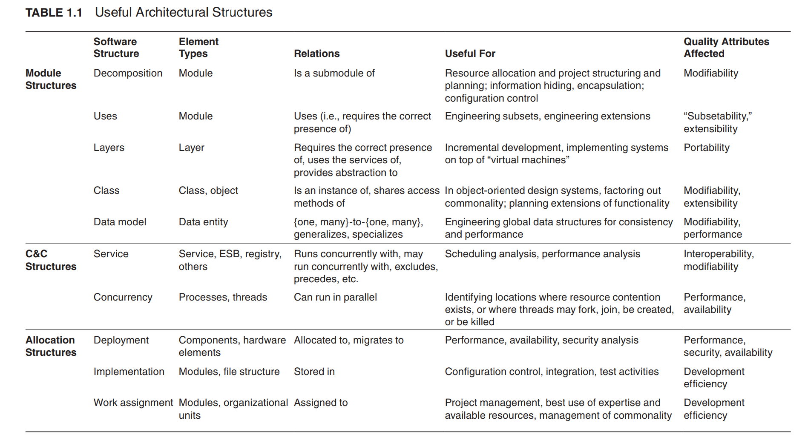

# Structure

## 结构分类

### Module

- Module structures embody decisions as to how the system is to be structured as a set of code or data units that have to be constructed or procured.

  模块结构体现了系统是如何由一套必须的代码或数据单元来构造的。

- In any module structure, the elements are modules of some kind (perhaps classes, or layers, or merely divisions of functionality, all of which are units of implementation).

  模块可以由如下元素组成：类、层、部分功能，所有这些都是实现的单元。

- Modules represent a static way of considering the system. Modules are assigned areas of functional responsibility; there is less emphasis in these structures on how the resulting software manifests itself at runtime.

  模块结构很少关心软件在运行时的自身表现。模块展示了对系统的一种静态的思考。模块被分配了功能职责的一部分；

- Module structures allow us to answer questions such as these:

  模块结构可以帮助我们搞清楚如下问题：

  - What is the primary functional responsibility assigned to each module? 每个模块的主要功能职责
  - What other software elements is a module allowed to use? 模块被允许使用哪些其他软件元素
  - What other software does it actually use and depend on? 模块实际使用和依赖哪些其他软件
  - What modules are related to other modules by generalization or specialization
    (i.e., inheritance) relationships? 模块间的关系是什么？泛化、继承？

- In other words, examining a system’s module structures—that is, looking at its module views—is an excellent way to reason about a system’s modifiability。

  通过查看系统的模块结构可推理出系统的可修改性。

#### Decomposition

The units are modules that are related to each other by the is-a-submodule-of relation, showing how modules are decomposed into smaller modules recursively until the modules are small enough to be easily understood.

这些模块是通过“是一种子模块”的关系来与其他模块产生关联，展示了这些模块是如何被递归的分解成更小的模块，以便可以很轻松的理解他们。类似分而治之的思想。

Modules often have products (such as interface specifications, code, test plans, etc.) associated with them.

这些模块通常和接口文档、代码、测试计划等联系在一起。

The decomposition structure determines, to a large degree, the system’s modifiability, by assuring that likely changes are localized. That is, changes fall within the purview of at most a few (preferably small) modules.

因为分解结构可以保证变化是局部的，所以，可以在很大程度上决定系统的可修改性。也就是说，更改只能属于少数（并且是小的）模块内。

The units in this structure tend to have names that are organization-specific such as “segment” or “subsystem.”

这些分解结构也被称为“片段”或“子系统”。

#### Uses

In this important but overlooked structure, the units here are also modules, perhaps classes. The units are related by the uses relation, a specialized form of dependency.

这种结构虽然重要但是常被忽略，这些单元可能是类。他们通过“使用关系”来产生关联，一种特殊的依赖形式。

A unit of software uses another if the correctness of the first requires the presence of a correctly functioning version (as opposed to a stub) of the second.

如果第一个软件单元的正确性需要第二个软件单元的正确运行版本 (而不是存根) 的存在，那么这个软件单元就会使用另一个软件单元。

The uses structure is used to engineer systems that can be extended to add functionality, or from which useful functional subsets can be extracted.

uses 结构用于设计可以扩展以添加功能的系统，或者可以从中提取有用的功能子集。

The ability to easily create asubset of a system allows for incremental development.

轻松创建系统子集的功能允许增量开发。

#### Layer

The modules in this structure are called layers. A layer is an abstract “virtual machine” that provides a cohesive set of services through a managed interface.

分层是一种抽象的虚拟机，它通过一个托管理的接口来提供一套内聚的服务。

Layers are allowed to use other layers in a strictly managed fashion; in strictly layered systems, a layer is only allowed to use the layer immediately below.

分层在使用其他层的时候采用严格的管理方式；在严格的分层系统中，一个层只允许调用它直接的下层。

This structure is used to imbue a system with portability, the ability to change the underlying computing platform.

这种结构用于为系统注入可移植性，即改变底层计算平台的能力。

#### Class (or generalization)

The module units in this structure are called classes. The relation is inherits from or is an instance of. This view supports reasoning about collections of similar behavior or capability (e.g., the classes that other classes inherit from) and parameterized differences.

类结构体现的关系是”继承“或”是谁的实例“。类结构视图支持推理相似的行为或能力（该类继承其他类）的集合以及参数化差异。

The class structure allows one to reason about reuse and the incremental addition of functionality.

类结构允许人们考虑重用和增加额外的功能。

If any documentation exists for a project that has followed an object-oriented analysis and design process, it is typically this structure.

任何面向对象的分析和设计过程都是典型的类结构。

#### Data model

The data model describes the static information structure in terms of data entities and their relationships.

数据模型描述的是静态信息结构，静态信息结构是指数据实体以及实体之间的关系。

For example, in a banking system, entities will typically include Account, Customer, and Loan.

例如，在银行系统中，实体通常包括账号、客户和贷款。

Account has several attributes, such as account number, type (savings or checking), status, and current balance. A relationship may dictate that one customer can have one or more accounts, and one account is associated to one or two customers.

账户有多种属性，例如账号、类型（储蓄或支票）、状态以及当前余额。关系可以是规定：一个客户可以有一个或多个账号，一个账户可以关联一个或多个客户。

### Component-and-connector

- Component-and-connector structures embody decisions as to how the system is to be structured as a set of elements that have runtime behavior (components) and interactions (connectors).

  组件 - 连接器结构：提现了系统是如何通过一套有运行时的行为（组件）和交互（连接器）的元素组织起来的。

- In these structures, the elements are runtime components (which are the principal units of computation and could be services, peers, clients, servers, ilters, or many other types of runtime elements) and connectors (which are the communication vehicles among components, such as call-return, process synchronization operators, pipes, or others).

  运行时的组件是重要的运算单元，可以是：服务、对等体（端对端）、客户端、服务器、过滤器以及其他类型的运行时元素；运行时的连接器是组件之间交流的载体工具，可以是调用 - 返回、进程同步操作、管道或者其他。

- Component-and-connector views help us answer questions such as these:

  组件 - 连接器可以解决如下问题：

  - What are the major executing components and how do they interact at runtime? 在运行时哪些是主要的执行组件以及它们之间是如何交互的？
  - What are the major shared data stores? 主要的共享数据存储有哪些？
  - Which parts of the system are replicated? 系统的哪部分是可复用的？
  - How does data progress through the system? 在系统中数据如何处理？
  - What parts of the system can run in parallel? 系统的各部分可以并行运行吗？

  - Can the system’s structure change as it executes and, if so, how? 系统的哪些部分可以并行处理系统在执行时，它的结构会不会发生改变，如果改变，是如何改变的。

- By extension, component-and-connector views are crucially important for asking questions about the system’s runtime properties such as performance, security, availability, and more.

  并且，组件 - 连接器视图对系统运行时的属性，如：性能、安全、可用性等等提出问题是相当重要的。

Component-and-connector structures show a runtime view of the system. In these structures the modules described above have all been compiled into executable forms.

组件 - 连接器结构展示了系统运行时的视图。在这些运行时的结构中，之前描述的“Modules”结构都被编译成了可执行的形式。

All component-and-connector structures are thus orthogonal to the module-based structures and deal with the dynamic aspects of a running system.

所有的组件 - 连接器结构都与基于“Module”的结构产生正交，并且处理运行时系统的动态方面。

The relation in all component-and-connector structures is attachment, showing how the components and the connectors are hooked together (The connectors themselves can be familiar constructs such as “invokes.”)

组件 - 连接器中的关系都是连接物，展示了组件和连接器如何连接在一起（连接器本身可以是熟悉的结构，如“调用”。）。

#### Service

The units here are services that interoperate with each other by service coordination mechanisms such as SOAP (see Chapter 6).

组成服务结构的单元是通过服务协调机制 (如 SOAP) 彼此互操作的服务 (见第 6 章)

The service structure is an important structure to help engineer a system composed of components that may have been developed anonymously and independently of each other.

服务结构是一种重要的结构，它有助于设计出一个由各种相互独立并且相互匿名的组件组成的系统。

#### Concurrency

This component-and-connector structure allows the architect to determine opportunities for parallelism and the locations where resource contention may occur.

组件和连接器结构允许架构师确定并行的机会和可能发生资源争用的位置。

The units are components and the connectors are their communication mechanisms.

组件和连接器是并发结构通信机制。

The components are arranged into logical threads; a logical thread is a sequence of computations that could be allocated to a separate physical thread later in the design process.

组件被安排进了逻辑线程；一个逻辑线程是一个在后续的设计过程中被分配给一个独立的物理线程的计算序列。

The concurrency structure is used early in the design process to identify the requirements to manage the issues associated with concurrent execution.

并发结构在设计过程的早期使用，以识别并管理与并发执行相关的问题的需求

### Allocation

- Allocation structures embody decisions as to how the system will relate to nonsoftware structures in its environment (such as CPUs, file systems, networks, development teams, etc.). These structures show the relationship between the software elements and elements in one or more external environments in which the software is created and executed. Allocation views help us answer questions such as these:

  分配结构体现了系统在其环境中如何与非软件结构 (如 CPU、文件系统、网络、开发团队等) 相关的决策。这些结构显示了软件元素和创建和执行软件的一个或多个外部环境中的元素之间的关系。分配视图帮助我们回答以下问题：

  - What processor does each software element execute on?

    每个软件元件在哪个处理器上执行？

  - In what directories or files is each element stored during development, testing, and system building?

    在开发、测试和系统构建过程中，每个元素存储在什么目录或文件中？

  - What is the assignment of each software element to development teams?

    开发团队对于每个软件元素的任务是什么？

Allocation structures define how the elements from C&C or module structures map onto things that are not software: typically hardware, teams, and file systems.

分配结构的定义是：如果将组件 - 连接器结构或者模块结构映射到非软件的事物上去：通常是硬件、团队及文件系统。

#### Deployment

The deployment structure shows how software isassigned to hardware processing and communication elements.

部署结构显示了如何将软件分配给硬件以对元素进行处理和通信。

The elements are software elements (usually a process from a C&C view), hardware entities (processors), and communication pathways.

这些元素是：软件元素 (从组件 - 连接器视图来看，通常是一个进程)、硬件实体 (处理器) 和通信路径。

Relations are allocated-to, showing on which physical units the software elements reside,and migrates-to if the allocation is dynamic.

针对分配关系，那就展示软件元素驻留在哪个物理单元上；如果是动态分配，那就展示软件元素迁移到哪个物理单元。

This structure can be used to reason about performance, data integrity, security, and availability. It is of particular interest in distributed and parallel systems.

这个结构可以用来分析性能、数据完整性、安全性和可用性。它在分布式和并行系统中尤为重要。

#### Implementation

This structure shows how software elements (usually modules) are mapped to the file structure(s) in the system’s development, integration, or configuration control environments.

实现结构显示了软件元素 (通常是模块) 是如何映射到系统开发、集成或配置控制环境中的文件结构中的。

This is critical for the management of development activities and build processes. (In practice, a screenshot of your development environment tool, which manages the implementation environment, often makes a very useful and sufficient diagram of your implementation view.)

这对于开发活动和构建过程的管理至关重要。(在实践中，管理实现环境的开发环境工具的截图，通常会形成非常有用和充分的实现视图图。)

#### Work assignment

This structure assigns responsibility for implementing and integrating the modules to the teams who will carry it out.

工作分配结构将实现和集成模块的责任分配给将负责实现的团队。

Having a work assignment structure be part of the architecture makes it clear that the decision about who does the work has architectural as well as management implications.

将工作分配结构作为体系结构的一部分，可以清楚地表明由谁来完成工作的决策具有体系结构和管理方面的含义。

Also, on large multi-sourced distributed development projects, the work assignment structure is the means for calling out units of functional commonality and assigning those to a single team, rather than having them implemented by everyone who needs them. This structure will also determine the major communication pathways among the teams: regular teleconferences, wikis, email lists, and so forth.

同样，在大型多源分布式开发项目中，工作分配结构是调用功能公共单元并将其分配给单个团队的方法，而不是让每个需要它们的人实现它们。这个结构还将确定团队之间的主要通信路径：定期电话会议、wiki、电子邮件列表，等等。

## 各结构含义/关系/用途

