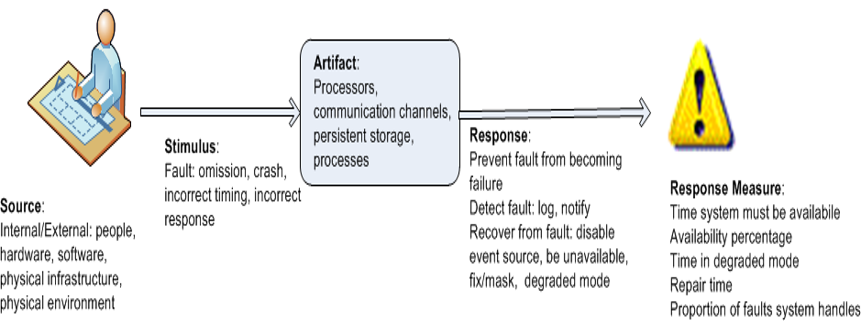

# Understanding quality attributes

该章重点就是 **Quality attribute scenario**，其余的部分看大纲和 PPT 很快就能理解。由于这个部分是如此重要，以至于我必须贴原文。

来自：<http://arc.misday.com/part2/04.4.specifying_quality_attribute_requirements.html>

A quality attribute requirement should be unambiguous and testable. We use a common form to specify all quality attribute requirements. This has the advantage of emphasizing the commonalities among all quality attributes. It has the disadvantage of occasionally being a force-fit for some aspects of quality attributes.

质量属性需求应该是明确的和可测试的。我们使用一个通用的形式来指定所有的质量属性需求。这样做的好处是强调了所有质量属性之间的共性。它的缺点是偶尔在质量属性的某些方面是强制适合的。

Our common form for quality attribute expression has these parts:

我们常用的质量属性表达式有以下几个部分：

- Stimulus. We use the term “stimulus” to describe an event arriving at the system. The stimulus can be an event to the performance community, a user operation to the usability community, or an attack to the security community. We use the same term to describe a motivating action for developmental qualities. Thus, a stimulus for modifiability is a request for a modification; a stimulus for testability is the completion of a phase of development.
- 刺激。我们使用术语“刺激”来描述到达系统的事件。刺激可以是对性能方面的事件，对可用性方面的用户操作，或者对安全方面的攻击。我们用同样的术语来描述发展品质的激励行为。因此，可修改性的刺激是对修改的请求；对可测试性的刺激是开发阶段的完成。

- Stimulus source. A stimulus must have a source—it must come from somewhere. The source of the stimulus may affect how it is treated by the system. A request from a trusted user will not undergo the same scrutiny as a request by an untrusted user.
- 刺激源。刺激必须有一个来源——它必须来自某个地方。刺激的来源可能会影响系统对刺激的处理方式。来自受信任用户的请求不会像来自不受信任用户的请求那样经过同样的审查。

- Response. How the system should respond to the stimulus must also be specified. The response consists of the responsibilities that the system (for runtime qualities) or the developers (for development-time qualities) should perform in response to the stimulus. For example, in a performance scenario, an event arrives (the stimulus) and the system should process that event and generate a response. In a modifiability scenario, a request for a modification arrives (the stimulus) and the developers should implement the modification—without side effects—and then test and deploy the modification.

  响应。系统应该如何对刺激作出反应也必须明确。响应由系统 (对于运行时质量) 或开发人员 (对于开发时质量) 在响应刺激时应该执行的职责组成。例如，在性能场景中，一个事件 (刺激) 到达，系统应该处理该事件并生成响应。在可修改性场景中，修改请求到达 (刺激)，开发人员应该实现修改—没有副作用—然后测试和部署修改。

- Response measure. Determining whether a response is satisfactory—whether the requirement is satisfied—is enabled by providing a response measure. For performance this could be a measure of latency or throughput; for modifiability it could be the labor or wall clock time required to make, test, and deploy the modification.

  **响应的度量**（不是措施！）。通过提供响应度量，可以确定响应是否令人满意——需求是否得到满足。对于性能，这可以是延迟或吞吐量的度量;对于可修改性，它可能是制作、测试和部署修改所需的人工或时钟时间。

These four characteristics of a scenario are the heart of our quality attribute specifications. But there are two more characteristics that are important: environment and artifact.

场景的这四个特征是我们质量属性规范的核心。但是还有两个更重要的特征：**环境和工件**。

- Environment. The environment of a requirement is the set of circumstances in which the scenario takes place. The environment acts as a qualifier on the stimulus. For example, a request for a modification that arrives after the code has been frozen for a release may be treated differently than one that arrives before the freeze. A failure that is the fifth successive failure of a component may be treated differently than the first failure of that component.

  环境。需求的环境是场景发生的一组环境。环境对刺激起着限定作用。例如，在代码被冻结之后到达的修改请求可能与在冻结之前到达的修改请求的处理方式不同。一个部件连续发生第五次故障的处理方法可能与该部件第一次发生故障的处理方法不同。

- Artifact. Finally, the artifact is the portion of the system to which the requirement applies. Frequently this is the entire system, but occasionally specific portions of the system may be called out. A failure in a data store may be treated differently than a failure in the metadata store. Modifications to the user interface may have faster response times than modifications to the middleware.

  工件。最后，工件是**需求应用到的系统部分**。这通常是整个系统，但偶尔也会调用系统的特定部分。处理数据存储中的故障可能与处理元数据存储中的故障不同。对用户界面的修改可能比对中间件的修改具有更快的响应时间。

To summarize how we specify quality attribute requirements, we capture them formally as six-part scenarios. While it is common to omit one or more of these six parts, particularly in the early stages of thinking about quality attributes, knowing that all parts are there forces the architect to consider whether each part is relevant.

为了总结我们如何指定质量属性需求，我们将它们正式捕获为六部分场景。虽然忽略这六个部分中的一个或多个部分是很常见的，特别是在考虑质量属性的早期阶段，知道所有部分都在那里迫使架构师考虑每个部分是否相关。

In summary, here are the six parts:

**总而言之**，以下是六个部分：

1. Source of stimulus. This is some entity (a human, a computer system, or any other actuator) that generated the stimulus.

   刺激的来源。这是产生刺激的某种实体 (人、计算机系统或任何其他执行器)。

2. Stimulus. The stimulus is a condition that requires a response when it arrives at a system.

   刺激。刺激是一种条件，当它到达一个系统时需要一个反应。

3. Environment. The stimulus occurs under certain conditions. The system may be in an overload condition or in normal operation, or some other relevant state. For many systems, “normal” operation can refer to one of a number of modes. For these kinds of systems, the environment should specify in which mode the system is executing.

   环境。刺激在一定条件下发生。系统可能处于过载状态或正常运行状态，也可能处于其他相关状态。对于许多系统，“正常”操作可以指许多模式中的一种。对于这些类型的系统，环境应该指定系统以哪种模式执行。

4. Artifact. Some artifact is stimulated. This may be a collection of systems, the whole system, or some piece or pieces of it.

   工件。一些人工制品被刺激了。**这可能是一个系统的集合，整个系统，或者其中的一部分**。

5. Response. The response is the activity undertaken as the result of the arrival of the stimulus.

   响应。反应是由于刺激的到来而进行的活动。

6. Response measure. When the response occurs, it should be measurable in some fashion so that the requirement can be tested.

   **响应的度量**。当出现响应时，应该以某种方式对其进行测量，以便对需求进行测试。

We distinguish general quality attribute scenarios (which we call “general scenarios” for short)—those that are system independent and can, potentially, pertain to any system—from concrete quality attribute scenarios (concrete scenarios)—those that are specific to the particular system under consideration.

我们将一般的质量属性场景 (我们简称为“一般场景”)——那些独立于系统并且可能潜在地属于任何系统的场景——与具体的质量属性场景 (具体的场景)——那些特定于所考虑的特定系统的场景区分开来。

We can characterize quality attributes as a collection of **general scenarios**. Of course, to translate these generic attribute characterizations into **requirements for a particular system**, the general scenarios need to be made system specific. Detailed examples of these scenarios will be given in Chapters 5–11.

我们可以将质量属性描述为**一般场景的集合**。当然，为了将这些通用的属性描述转换为**特定系统的需求**，一般的场景需要与系统相关。这些场景的详细示例将在第 5-11 章中给出。

- Figure 4.1 shows the parts of a quality attribute scenario that we have just discussed.

  图 4.1 显示了我们刚刚讨论过的质量属性场景的各个部分。

- Figure 4.2 shows an example of a general scenario, in this case for availability.

  图 4.2 显示了一个通用场景的示例，在这个示例中是可用性。

**Note：也就是说有一般的场景集合的描述（针对某个质量要求），也有特定的系统的场景的描述。**

