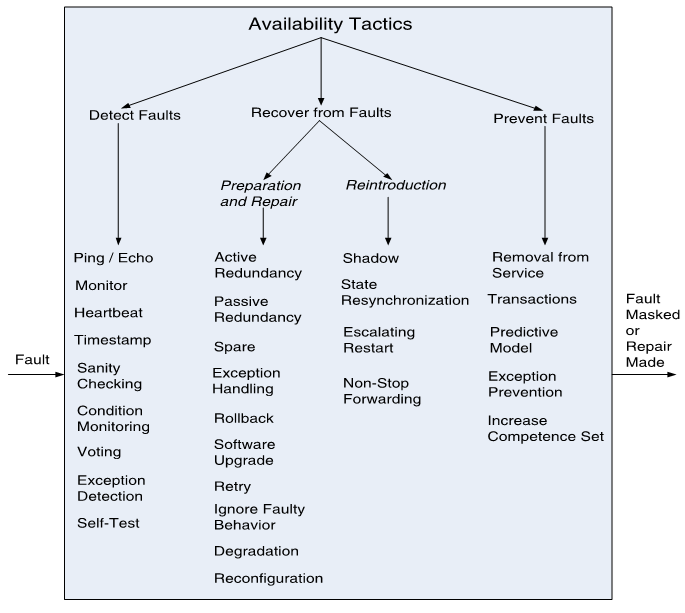

# Availability

## definition

**Availability** refers to a property of **software that it is there and ready** to carry out its task when you need it to be.

## Availability General Scenario

| Portion of      Scenario         | Possible Values                                              |
| -------------------------------- | ------------------------------------------------------------ |
| Source                           | Internal/external: people, hardware, software, physical infrastructure, physical environment |
| 刺激来源                         | 内部/外部：人员、硬件、软件、物理基础设施、物理环境          |
| Stimulus                         | Fault: omission, crash, incorrect timing, incorrect response |
| 刺激                             | 故障：遗漏、崩溃、错误的时机、错误的响应                     |
| Artifact                         | System’s processors, communication  channels, persistent storage, processes |
| （因刺激运作起来的系统中的）工件 | 系统的处理器、通信通道、持久存储、进程                       |
| Environment                      | Normal operation, startup, shutdown, repair mode, degraded operation, overloaded operation |
| 环境                             | 正常运行、启动、停机、修复模式、降级运行、过载运行           |
| Response                         | Prevent the fault from becoming a failure **Detect the fault:** - log the fault - log the fault - notify appropriate entities (people or systems)  **Recover from the fault:** - disable source of events causing the fault - be temporarily unavailable while repair is being effected - fix or mask the fault/failure or contain the damage it causes - operate in a degraded mode while repair is being effected |
| 响应                             | 防止 fault 变成 failure 检测 fault： - 记录 fault - 记录 fault - 通知相应的实体（人或系统） 从 fault 中恢复： - 禁用导致 fault 的事件源 - 在进行修复时暂时不可用 - 修复或掩盖 fault/failure 或控制其造成的损害 - 在进行修复时以降级模式运行 |
| Response Measure                 | Time or time interval when the system  must be available Availability percentage (e.g.  99.999%) Time to detect the fault Time to repair the fault Time or time interval in which system can be in degraded mode Proportion (e.g., 99%) or rate (e.g., up to 100 per second) of a certain class of faults that the system prevents,  or handles without failing |
| 响应的度量                       | 系统必须可用的时间或时间间隔 可用性百分比 (如 99.999%) fault 检测时间 fault 修复时间 系统可处于降级模式的时间或时间间隔 某类 fault，系统能够预防或处理的比例（如 99%）或速率（如每秒不超过 100 次） |

## Sample Concrete Availability Scenario

- The **heartbeat monitor** determines that the **server** is **nonresponsive** during **normal operations**. The system **informs the operator** and continues to operate with **no downtime**.
- Let us analyze if this scenario is complete!
  - Stimulus: non-responsiveness
  - Response: inform the operator
  - Response measure: no downtime, or 100 availability percentages
  - Environment: normal operation
  - Artifact: heartbeat monitor
  - Stimulus source: server
- 当服务器（Stimulus source）正常运行（Environment）但无响应（Stimulus）时，心跳检测器（Artifact）就通知操作员（Response measure）。系统需要不间断运行（Response measure）。

## Goal of Availability Tactics

前提：Fault vs. failure

参考：<https://blog.csdn.net/william_munch/article/details/84109466>

- Fault -- 故障
  - 编码过程中，存在于软件中的静态缺陷（Defect）
- Error -- 错误
  - 软件运行过程中，运行 fault 后，触发得到的结果（错误）。
- Failure -- 失效
  - 失效。error 传到软件外部，用户和测试人员能够观测的到的失效行为。
  - 指不完全符合给定的需求，实际结果或行为与期望结果或行为之间的偏差。
  - 当一个系统不能执行所要求的功能时，即为 Failure。

---

- **Availability tactics** enable a system to **endure faults** so that services remain compliant with their specifications.

  - **The tactics keep faults from becoming failures**

  - or at least **bound the effects of the fault** and make repair possible

- **可用性策略**使系统能够**承受 faults**，从而使服务始终符合其规范。
  - **策略防止 faults 变成 failures**
  - 或至少**限制 fault 的影响**并使修复成为可能

## Availability Tactics

### Detect Faults 检测

- **Ping/echo**: used to determine reachability and the round-trip delay through the associated network path.

  通过关联的网络路径判断可达性和往返时延。

- **Monitor**: a component used to monitor the state of health of other parts of the system.

  用于监视系统其他部分的健康状态的组件。

- **Heartbeat**: a periodic message exchange between a system monitor and a process being monitored.

  系统监控器与被监控进程之间的周期性消息交换。

  - The process periodically resets the watchdog timer in its monitor,

    进程定期重置监视器中的看门狗定时器。

  - Piggybacking the heartbeat messages on to other control messages reduces the overhead.

  - 将心跳消息装载到其他控制消息上可以减少开销。

- Difference between ping and heartbeat? ping 和 heartbeat 的区别？

  - Who initiates the health check? 谁发起健康检查？

- **Timestamp**: used to detect incorrect sequences of events, primarily in distributed message-passing systems.

  用于检测不正确的事件序列，主要用于分布式消息传递系统。

- **Condition Monitoring**: checking conditions in a process or device, or validating assumptions made during the design.

  状态监测：检查工艺或设备中的条件，或验证设计过程中的假设。

  - For example, checksum in data storage and transmission.

    例如数据存储和传输中的校验和。

- **Voting**: the common realization of this tactic is Triple Modular Redundancy (TMR)

  投票：这种策略的常见实现是三模冗余 (TMR)

- **Exception Detection**: detection of a system condition that alters the normal flow of execution, e.g. system exception, parameter typing, timeout.

  异常检测：检测改变正常执行流程的系统状况，如系统异常、参数输入、超时等。

- **Self-test**: procedure for a component to test itself for correct operation.

  自检：部件测试自身是否正确运行的程序。

### Recover from Faults (Preparation & Repair) 恢复

- **Active Redundancy (hot spare)**: all nodes in a *protection group* process identical inputs in parallel, allowing redundant spares to maintain *synchronous state* with the active nodes.

  **主动冗余 (热备)**：*保护组* 中的所有节点并行处理相同的输入，允许冗余备件与活动节点保持同步状态。

- **Spare (cold spare)**: redundant spares of a protection group remain out of service until a fail-over occurs, at which point a power-on-reset procedure is initiated on the redundant spare prior to its being placed in service.

  **备用 (冷备)**:：保护组的冗余备用在故障切换前处于不工作状态，故障切换后，组保护的冗余备用在投入使用前会启动上电复位程序。

- **Passive Redundancy (warm spare)**: only the active members of the protection group process input traffic;

  **被动冗余 (热备)**：只有保护组的主动成员处理输入流量；

  - one of their duties is to provide the redundant spare(s) with periodic state updates.

    它们的职责之一是定期更新冗余备用设备的状态。

- **Rollback**: revert to a previous known good state, referred to as the “rollback line”.

  **回滚**：恢复到以前已知的良好状态，称为“回滚行”。

  - This tactic is **combined** with redundancy tactics. 此策略与冗余策略相结合。
  - After a rollback has occurred, a standby version of the failed component becomes active. 回退后，故障组件的备用版本变为主用版本。
  - Rollback depends on a copy of a previous state (a checkpoint). 回滚依赖于前一个状态的副本（检查点）。
  - Checkpoint can be stored in a fixed location and needs to be updated regularly. 检查点可以存储在固定的位置，需要定期更新。

- **Exception Handling**: dealing with the exception by reporting it or handling it, potentially masking the fault by correcting the cause of the exception and retrying.

  **异常处理**：通过报告或处理异常来处理异常，通过纠正异常原因并重试来潜在地掩盖故障。

- **Retry**: where a failure is transient and retrying the operation may lead to success.

  **重试**：操作失败是暂时的，重试可能会成功。

  - For example, network re-transmission 例如，网络重传

- **Ignore Faulty Behavior**: ignoring messages sent from a source when it is determined that those messages are spurious.

  **忽略错误行为**：忽略从一个源发送的消息，当确定这些消息是虚假的。

  - E.g., ignore the messages from a denial of service attacker

    例如，忽略来自拒绝服务攻击者的消息

- **Degradation**: maintains the most critical system functions in the presence of component failures, dropping less critical functions.

  **退化**：在存在组件故障的情况下保持最关键的系统功能，减少不太关键的功能。

- **Reconfiguration**: reassigning responsibilities to the resources left functioning, while maintaining as much functionality as possible.

  **重新配置**：将职责重新分配给剩余功能的资源，同时保持尽可能多的功能。

### Prevent Faults 预防

- **Removal From Service**: temporarily placing a system component in an out-of-service state for the purpose of mitigating potential system failures.

  **从服务中移除**：暂时将系统组件置于服务外状态，以减轻潜在的系统故障。

- **Transactions**: bundling state updates so that asynchronous messages exchanged between distributed components are *atomic*, *consistent*, *isolated*, and *durable*.

- **事务**：绑定状态更新，以便分布式组件之间交换的异步消息是*原子的*，*一致的*，*隔离的*和*持久的*。

- **Predictive Model**: take corrective action when conditions are detected that are predictive of likely future faults.

  **预测模型**：当检测到预测未来可能出现故障的情况时，采取纠正措施。

- **Exception Prevention**: preventing system exceptions from occurring by preventing it via smart pointers, abstract data types, wrappers.

  **异常预防**：通过智能指针，抽象数据类型，包装器来防止系统异常的发生。

- **Increase Competence Set:** designing a component to handle more cases—faults—as part of its normal operation.

  **增加能力集**：设计一个组件来处理更多的情况 - 故障 - 作为其正常运行的一部分。
