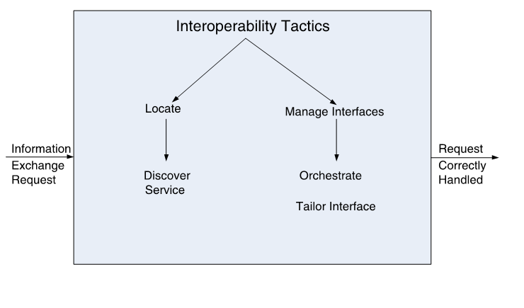

# Interoperability

## definition

- **Interoperability** is about the degree to which two or more systems can usefully exchange meaningful information via interfaces in a particular context.

- 互操作性是指两个或多个系统能够在特定上下文中通过接口有效地交换有意义的信息的程度。

- Any discussion of **a system’s interoperability** needs to identify with whom, and under what circumstance.

  任何关于系统互操作性的讨论都需要确定是谁，以及在什么情况下。

- **Syntactic interoperability** is the ability to exchange data.

  语法互操作性是交换数据的能力。

- **Semantic interoperability** is the ability to interpret the data being exchanged.

  语义互操作性是解释正在交换的数据的能力。

## Interoperability General Scenario

| Portion of Scenario              | Possible Values                                              |
| -------------------------------- | ------------------------------------------------------------ |
| Source                           | A system                                                     |
| 刺激来源                         | 系统                                                         |
| Stimulus                         | A **request** to exchange information among system(s).       |
| 刺激                             | 在系统之间交换信息的**请求**。                               |
| Artifact                         | The systems that wish to interoperate                        |
| （因刺激运作起来的系统中的）工件 | 希望进行互操作的系统                                         |
| Environment                      | System(s) wishing to interoperate are discovered at run time or known prior to run time. |
| 环境                             | 希望进行互操作的系统是在运行时发现的，或者是在运行前已知的。 |
| Response                         | One or more of the following: - the request is (appropriately) **rejected** and appropriate entities (people or systems) are notified - the request is (appropriately) **accepted** and information is exchanged successfully - the request is **logged** by one or more of the involved systems |
| 响应                             | 下列一项或多项： - 请求被（适当地）**拒绝**，适当的实体（人或系统）得到通知 - 请求被（适当地）**接受**，信息被成功交换 - 请求被一个或多个相关系统**记录** |
| Response Measure                 | One or more of the following: - percentage of information exchanges correctly processed - percentage of information exchanges rejected   |
| 响应的度量                       | 下列一项或多项： - 正确处理的信息交换百分比 - 拒绝的信息交换百分比  |

## Sample Concrete Availability Scenario

- Our vehicle information system sends our current location to the traffic monitoring system.
- The traffic monitoring system combines our location with other information, overlays this information on a Google Map, and **broadcasts** it.
- Our location information is correctly included with a probability of 99.9%.

---

## Goal of Interoperability Tactics

- For two or more systems to usefully exchange information they must
  - Know about each other. That is the purpose behind the locate tactics.
  - Exchange information in a semantically meaningful fashion. That is the purpose behind the manage interfaces tactics. Two aspects of the exchange are
    - Provide services in the correct sequence
    - Modify information produced by one actor to a form acceptable to the second actor.

- 两个或多个系统要有效地交换信息，它们必须
  - 互相了解。这就是定位策略背后的目的。
  - 以语义上有意义的方式交换信息。这就是管理接口策略背后的目的。交换的两个方面是
    - 按照正确的顺序提供业务
    - 将一个参与者产生的信息修改为第二个参与者可以接受的形式。

## Interoperability Tactics

### Locate 定位

- **Service Discovery**: Locate a service through searching
- There are many **service discovery** mechanisms:
  - UDDI for Webservices
  - Jini for Java objects
  - Simple Service Discovery Protocol (SSDP) as used in Universal plug-and-play (UPnP)
  - DNS Service Discovery (DNS-SD)
  - Bluetooth Service Discovery Protocol (SDP)
- Service Discovery – Necessary conditions
  - The searcher wants to find the searched entity and the searched entity **wants to be found**
  - The searched entity must have **identifiers**
  - The searcher must acquire **sufficient identifiers** to identify the searched entity

- Searching methods
  - Searcher’s initiative 寻找者
  - Searched initiative 被寻找者
  - Registration – a middleman 登记（中介）

#### Searching Method – Searcher’s initiative 寻找者

- **Flood/Broadcast request** 洪水/广播请求
  - Ask every entity and wait for answer
- Examples
  - Paging in the location area to find the mobile terminal
  - DHCP discover: the client broadcasts on the local subnet to find available servers to ask for IP address
- Efficient and less resource consuming for the searcher
- Low resource consuming for the searched
- But disturbing and resource consuming for the environment

---

- **Successive request** 连续请求
  - Ask one entity at the time and perform matching
  - If no match, continue with next until finding a match
- Less efficient and high resource consuming for the searcher
- But less disturbing and less resource consuming for the environment

#### Searching Method – Searched’s initiative 被寻找者

- **Continuous/periodical advertisement** 连续/定期广告
  - Continuously or periodically publish advertisement such that every searcher can notice and respond
- Efficient but high resource consuming for the searched
- Low resource demanding for the searcher
- Disturbing and resource consuming for the environment

---

- **Advertisement upon arrival of new entity** 新实体到达时进行广告
  - E.g., present himself when a new person enters the lobby
- Require detection mechanism upon new entity arrival
- Less resource consuming for the searched
- Low resource demanding for the searcher
- Less disturbing and resource consuming for the environment

#### Searching Method – Registration 登记（中介）

- **Introduction of the “middlemen”, registry**
  - The searched entity registers to a registry
  - The searcher can address to the registry to get information and find the searched entity
- Example
  - Service providers register their web services at UDDI registry which can be searched and found by Service Requestors
- Less resource consumption on both searchers, searched, and less disturbing to environment
- but the registry must be available, reliable, and correct

### Manage Interfaces 管理接口

- **Orchestrate**: uses a control mechanism to coordinate, manage and sequence the invocation of services.

  **排列**：使用控制机制来协调、管理和排序服务调用。

- Orchestration is used when systems must interact in a complex fashion to accomplish a complex task.

  当系统必须以复杂的方式进行交互以完成复杂的任务时，使用排列。

- **Tailor Interface**: add or remove capabilities to an interface such as translation, buffering, or data-smoothing.

  **裁剪接口**：添加或删除功能的接口，如翻译，缓冲，或数据平滑。

## Quality Design Decisions for Interoperability

- Allocation of Responsibility 责任分配
- Coordination Model 协调模型
- Data Model 数据模型
- Mapping among Architectural Elements 建筑元素之间的映射
- Resource Management 资源管理
- Binding Time 绑定时间
