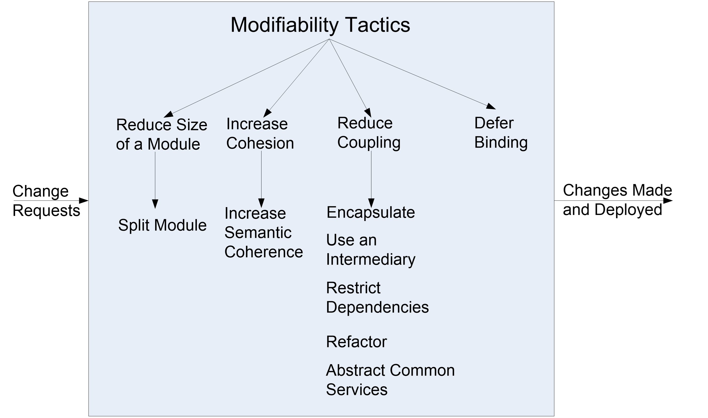

# 6 Modifiability

## definition

**Modifiability** is about change and our interest in it is in the cost and risk of making changes.

---

Example

|                                                              | the cost of introducing the  mechanisms to make the system more modifiable | the cost making the modification using the mechanism         |
| ------------------------------------------------------------ | ------------------------------------------------------------ | ------------------------------------------------------------ |
| do nothing for now                                           | zero                                                         | The cost of changing the source  code and revalidating the system |
| add additional component to the system now – user interface builder | The cost of constructing the UI  builder, it can be substantial | - The cost of producing the input to feed the builder – substantial or negligible - The cost of running the builder - negligible - The cost of the testing that is needed on the new interface – usually much less  than usual |

## Modifiability General Scenario

| Portion of Scenario              | Possible Values                                              |
| -------------------------------- | ------------------------------------------------------------ |
| Source                           | End user, developer, system administrator                    |
| 刺激来源                         | 终端用户、开发人员、系统管理员                               |
| Stimulus                         | A directive to add/delete/modify functionality, or change a quality attribute, capacity, or technology |
| 刺激                             | 增加/删除/修改功能，或改变质量属性、容量或技术的指令         |
| Artifact                         | Code, data, interfaces, components, resources, configurations, … |
| （因刺激运作起来的系统中的）工件 | 代码、数据、接口、组件、资源、配置……                         |
| Environment                      | Runtime, compile time, build time, initiation time, design time |
| 环境                             | 运行时，编译时，构建时，初始化时，设计时                     |
| Response                         | One or more of the following: - make modification - test modification - deploy modification |
| 响应                             | 下列一项或者多项： - 进行修改 - 测试修改 - 部署修改 |
| Response Measure                 | **Cost** in terms of: - number, size, complexity of affected artifacts - effort - calendar time - money (direct outlay or opportunity cost) - extent to which this modification affects other functions or quality attributes - new defects introduced |
| 响应的度量                       | **成本**： - 受影响工件的数量、大小和复杂性 - effort - 日历时间 - 资金 (直接支出或机会成本) - 此修改对其他功能或质量属性的影响程度 - 引入了新的缺陷 |

## Sample Concrete Modifiability Scenario

- The developer wishes to change the user interface by modifying the code at design time. The modifications are made with no side effects within three hours.
  - **Stimulus** – Wishes to change UI
  - **Artifact** – Code
  - **Environment**: Design time
  - **Response** – Change made
  - **Response measure** – No side effects in three hours
  - **Source** - Developer

## Goal of Modifiability Tactics

- controlling the **complexity** of making changes,
- controlling the **time and cost** to make changes.

## Modifiability Tactics

### Reduce Size of a Module 减小模块大小

- **Split Module**: If the module being modified includes a great deal of capability, the modification costs will likely be high.

  **拆分模块**：如果修改的模块包含大量功能，修改成本可能会很高。

- Refining the module into several smaller modules should reduce the average cost of future changes.

  将模块细化为几个更小的模块应该可以降低未来更改的平均成本。

### Increase Cohesion 增加内聚

> 内聚（cohesion）是一个模块内部各个元素彼此结合的紧密程度的度量。一个内聚程度高的模块，在理想情况下应当只做一件事。

- **Increase Semantic Coherence**: If the responsibilities A and B in a module do not serve the same purpose, they should be placed in different modules.

  **增加语义连贯**：如果模块中的职责 A 和 B 的目的不一致，则应将它们放在不同的模块中。

- This may involve creating a new module or it may involve moving a responsibility to an existing module.

  这可能涉及到创建一个新模块，也可能涉及到将职责转移到现有模块。

### Reducing Coupling 降低耦合

- What is coupling? 什么是耦合？

  - If two modules’ responsibilities overlap, a single change may affect them both.

    如果两个模块的职责重叠，单个更改可能会同时影响它们。

  - **Coupling** is measured by this overlap, i.e., by the probability that a modification to one module will propagate to the other.

    **耦合**是通过这种重叠来衡量的，即对一个模块的修改将传播到另一个模块的概率。

  - High coupling is an enemy of modifiability.

    高耦合是可修改性的敌人。

---

- **Encapsulate**: Encapsulation introduces an explicit interface to a module. This interface includes an API and its associated responsibilities.

  **封装**：封装为模块引入一个显式接口。该接口包括 API 及其相关职责。

- **Use an Intermediary**: Given a dependency between responsibility A and responsibility B (for example, carrying out A first requires carrying out B), the dependency can be broken by using an intermediary.

  **使用中介**：给定职责 A 和职责 B 之间的依赖关系（例如，首先执行 A 需要执行 B），可以通过使用中介来打破依赖关系。

- **Restrict Dependencies**: restricts the modules which a given module interacts with or depends on.

  **限制依赖**：限制给定模块与之交互或依赖的模块。

  - By restricting a module’s visibility and by authorization

    通过限制模块的可见性和授权

  - For example, a layer is allowed to see the modules in its bottom layer

    例如，允许一个层查看其底层的模块

- **Abstract Common Services**: where two modules provide not-quite-the-same but similar services, it may be cost-effective to implement the services just once in a more general (abstract) form.

  **提取公共服务**：当两个模块提供不完全相同但相似的服务时，以更一般（抽象）的形式一次实现这些服务可能是经济有效的。

## Publish/Subscribe Model

简单的说就是比客户端/服务器模式更加解耦的模式，中间出现了一个中介（**P/S service**）。

好处自然不用多说，坏处是引入了新的组件，使得可靠性下降；此外更容易遇到性能瓶颈。
