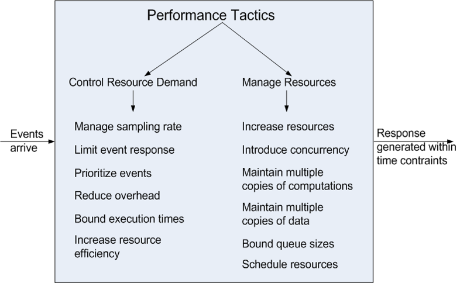

# Performance

## definition

- **It is about time**
- Performance is about time and the software system’s ability to meet timing requirements
- When events occur, the system must respond to them in time
- Events include interrupts, messages, requests from users or other systems, or clock events marking the passage of time

## Performance General Scenario

| Portion of Scenario              | Possible Values                                           |
| -------------------------------- | --------------------------------------------------------- |
| Source                           | Internal or external to the system                        |
| 刺激来源                         | 系统内部或外部                                            |
| Stimulus                         | Arrival of a periodic, sporadic, or stochastic event      |
| 刺激                             | 周期性的、零星的或随机事件的到来                          |
| Artifact                         | System or one or more components in the system.           |
| （因刺激运作起来的系统中的）工件 | 系统或系统中的一个或多个组件。                            |
| Environment                      | Operational mode: normal, emergency, peak load, overload. |
| 环境                             | 工作方式：正常、紧急、峰值负荷、过载。                    |
| Response                         | Process events, change level of service                   |
| 响应                             | 处理事件，更改服务级别                                    |
| Response Measure                 | Latency, deadline, throughput, jitter, miss rate          |
| 响应的度量                       | 延迟，截止日期，吞吐量，抖动，缺失率                      |

## Sample Concrete Performance Scenario

- You are an architect on the Campus Software team and you are designing the system for performance
- In the requirements document you have found this requirement:
  - **The system should process the transactions with an average latency of two seconds**

---

- Stimulus: transaction arrivals
- Source: ???
- Artifact: **the system**
- Response: **process the transactions**
- Response measure: average latency of two seconds
- Environment: ???

**This scenario is not complete, source and environment parts are missing**. The scenario we studied is not clear enough for the architect to make good design decisions.

**How to add the remaining parts?**

- We can use the **general scenario** to help us look for ideas.
- Then, clarify with the **stakeholders** about the details of the requirement.

---

**Users initiate transactions under normal operations.**

- **Source: users**
- **Environment: under normal operations**

## Goal of Performance Tactics

- To generate a response to an event arriving the system within some time-based constraint

  在某个基于时间的约束内对到达系统的事件生成响应

- The event can be single or a stream, and is the trigger to perform computation

  事件可以是单个事件，也可以是流事件，是执行计算的触发器

## Performance Tactics

### Control resource demand 控制资源需求

- **Reduce Overhead**: The use of intermediaries increases the resources consumed in processing an event stream; removing them improves latency.

  **减少开销**：使用中介体增加了处理事件流时消耗的资源；删除它们可以改善延迟。

  - Tradeoff between the modifiability and performance

    在可修改性和性能之间进行权衡

- **Bound Execution Times**: Place a limit on how much execution time is used to respond to an event.

  **绑定执行时间**：对用于响应事件的执行时间进行限制。

- In algorithm design, limiting the number of iterations is a method for bounding exec. time

  在算法设计中，限制迭代次数是约束执行时间的一种方法。

- Trade-off between the performance and accuracy

  性能和精度之间的权衡

- **Increase Resource Efficiency**: Improving the algorithms used in critical areas will decrease latency.

  **提高资源效率**：改进关键区域使用的算法将减少延迟。

- Reduce the complexity of the algorithm

  降低算法的复杂度

### Manage resources 管理资源

- **Increase Resources**: Faster processors, additional processors, additional memory, and faster networks all have the potential for reducing latency.

  **增加资源**：更快的处理器，额外的处理器，额外的内存和更快的网络都有减少延迟的潜力。

- **Increase Concurrency**: If requests can be processed in parallel, the blocked time can be reduced.

  **增加并发性**：如果请求可以并行处理，阻塞时间可以减少。

- Concurrency can be introduced by processing different streams of events on different threads.

  并发可以通过在不同的线程上处理不同的事件流来引入。

- Maintain Multiple Copies of Data 维护数据的多个副本

  - **Data caching** is to keep copies of data on storage with different access speeds.

    **数据缓存**是将数据的副本以不同的访问速度保存在存储上。

    - E.g., memory access vs. disk access 例如，内存访问与磁盘访问
    - Local access vs. remote access via networks 本地访问 vs.通过网络远程访问

  - **Data replication** is to keep separate copies of data to reduce the contention from multiple simultaneous accesses

    **数据复制**是将数据保存在不同的副本上，以减少多个并发访问造成的争用

  - How to choose the data to be cached/replicated

    如何选择需要缓存/复制的数据

  - How to guarantee the consistency of multiple copies

    如何保证多个副本的一致性

- Scheduling 调度

  - When there is contention for a resource, the resource must be scheduled.

    当资源存在竞争时，必须对资源进行调度。

    - Processors needs to be scheduled 需要调度处理器
    - Buffers needs to be scheduled 需要对缓冲区进行调度
    - Networks are scheduled 网络被调度
