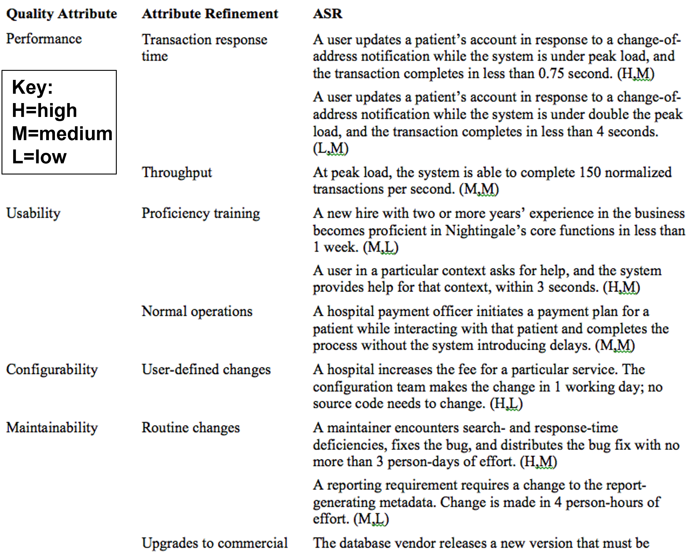

## ASR (Architecturally Significant Requirement)

By the end of this lesson you will be able to:

- understand the concept of ASR
- identify and capture ASR
- design for ASR

## 1 the concept of ASR

Architectures exist to build systems that satisfy requirements.

But, to an architect, not all requirements are created equal.

An **Architecturally Significant Requirement** (ASR) is a requirement that will **have a profound effect on the architecture**.

## 2 identify and capture ASR

### 2.0 Overview - Approaches to Capture ASRs

- From Requirements Document
- By Interviewing Stakeholders
- By Understanding the Business Goals
- **In Utility Tree** (效用树，实际的含义还要看下面讲解)

### 2.1 From Requirements Document

An obvious location to look for candidate (候选) ASRs is in the **requirements documents**.

Requirements should be in requirements documents!

Unfortunately, this is not usually the case.

---

**Many projects don’t create or maintain the detailed, high-quality requirements documents.**

Standard requirements pay more attention to functionality than quality attributes.

The architecture **is driven by quality attribute requirements** rather than functionalities.

Most requirements specification does not affect the architecture.

---

**Quality attributes are often captured poorly**, e.g.

- “The system shall be modular (模块化)”
- “The system shall exhibit high usability”
- “The system shall meet users’ performance expectations”

Much of what is useful to an architect is not in even the best requirements document.

ASRs often derive from **business goals** in the development organization itself.

### 2.2 Gathering ASRs from Stakeholders

**Stakeholders** often have no idea what QAs they want in a system.

- if you insist on quantitative (量化的) QA requirements, you’re likely to get numbers that are arbitrary.
- at least some of those requirements will be very difficult to satisfy.

**Architects** often have very good ideas about what QAs are reasonable to provide.

**Interviewing the stakeholders** is the surest (最确信的) way to learn what they know and need.

---

**The results of stakeholder interviews** should include

- a list of **architectural drivers**
- a set of **QA scenarios** that the stakeholders (as a group) prioritized.

This information can be used to:

- **refine** (细化) system and software **requirements**
- **understand** and **clarify** the system’s **architectural drivers** (架构驱动因素，塑造架构的主要质量属性目标)
- provide rationale (根本原因，逻辑依据) for why the architect subsequently (随后) made certain design decisions
- guide the development of prototypes and simulations
- influence **the order** in which the **architecture is developed**.

#### QAW (Quality Attribute Workshop)

The QAW is a facilitated, **stakeholder-focused** method to generate, prioritize, and refine **quality attribute scenarios** before the software architecture is completed.

---

Quality Attribute Scenario: Example

---

QAW Steps:

1. QAW Presentation and Introductions.
   - QAW facilitators describe the **motivation** for the QAW and explain **each step** of the QAW.
2. Business/Mission Presentation.
   - The stakeholder representing the business concerns presents the **system’s business context**, broad **functional requirements**, **constraints**, and **known quality attribute requirements**.
   - The quality attributes will be derived largely from the business/mission needs.
3. Architectural Plan Presentation.
   - The architect will present the **system architectural plans**.
   - This lets stakeholders know the current architectural thinking.
4. Identification of Architectural Drivers.
   - The facilitators will share **their list of key architectural drivers** assembled during Steps 2 and 3,
   - **Architectural drivers** includes overall requirements, business drivers, constraints, and quality attributes.
   - ask the stakeholders for clarifications, additions, deletions, and corrections, and **achieve a consensus** on the architectural drivers.
5. Scenario Brainstorming.
   - Each stakeholder expresses a scenario representing his or her concerns with respect to the system.
   - Facilitators ensure that each scenario has an explicit stimulus and response.
   - Make at least **one representative scenario** for each architectural driver listed in Step 4.
6. Scenario Consolidation.
   - Similar scenarios are consolidated where reasonable.
7. Scenario Prioritization.
   - Allocating each stakeholder a number of votes equal to 30 percent of the total number of scenarios.
   - Each stakeholder allocate their votes to scenario.
8. Scenario Refinement.
   - The top scenarios are refined and elaborated.
   - Facilitators help the stakeholders put the scenarios in the six-part scenario form.

### 2.3 Capturing ASRs in a Utility Tree

An ASR must have the following characteristics:

- *A profound impact on the architecture*

  Including this requirement will very likely result in a different architecture than if it were not included.

- *A high business or mission value*

  If the architecture is going to satisfy this requirement it must be of high value to important stakeholders.

#### Utility Tree

A way to **record ASRs all in one place**.

Establishes priority of each ASR in terms of

- Impact on architecture

- Business or mission value

**ASRs are captured as scenarios**.

Root of tree is placeholder node called “Utility”.

Second level of tree contains broad QA categories.

Third level of tree refines those categories.

**Leaf nodes are the concrete quality attribute scenarios**.

---

Utility Tree Example (excerpt) (节选)

---

Next Steps

ASRs that rate a (H,H) rating are the ones that deserve the most attention.

- *A very large number of these might be a cause for concern: Is the system achievable?*

Stakeholders can review the utility tree to make sure their concerns are addressed.

### 2.4 Tying the Methods Together

Summary of identify and capture ASR

How should you employ requirements documents, stakeholder interviews, Quality Attribute Workshops, and utility trees together?

- If important stakeholders have been overlooked in the requirements-gathering process, **use interviews or a QAW**.
- Use a **quality attribute utility tree** as a repository for the scenarios produced by a **QAW**.

## 3 design for ASR

Designing an Architecture

### 3.0 Overview - Design Strategy

- Decomposition
- Designing to Architecturally Significant Requirements
- Generate and Test

### 3.1 Decomposition

Architecture determines quality attributes.

**Important quality attributes** are characteristics of the *whole* system.

Design begins with the whole system.

- **The whole system is decomposed into parts**.
- Each part may inherit all or part of the quality attribute requirements.

### 3.2 Designing to Architecturally Significant Requirements

Remember architecturally significant requirements (ASRs)?

These are the requirements that you must satisfy with the design.

- There are a **small number** of these.
- They are the **most important** (by definition).

Two questions:

- What happens to the other requirement?
- Do I design for one ASR at a time or all at once?

---

What About Other Quality Requirements?

---

How Many ASRs Simultaneously?

### 3.3 Generate and Test

View the **current design as a hypothesis**.

Ask whether the current design satisfies the requirements (**test**).

If not, then **generate** a new hypothesis.

---

Raises the Following Questions

- Where does initial hypothesis come from?
- How do I test a hypothesis?
- How do I generate the next hypothesis?
- When am I done?

---

Where Does the Initial Hypothesis Come From?

- **Existing systems**
  - Very few systems are completely constructed from the scratch
- **Frameworks**
  - A **partial** design that provides services that are common in particular domains, e.g., web applications, middleware
  - A design framework may constrain communication to be via a broker, or publish-subscribe system
- **Less** **desirable** sources
  - Patterns and tactics
  - Design checklists
- Why “less desirable”?
  - The less desirable ones **do not cover all of the requirements**.
  - They typically omit many of the quality attribute requirements.

---

How Do I Test a Hypothesis?

- The **analysis technique** described previously
- **Design checklists** from quality attribute discussion.
- Architecturally significant requirements
- What is the output of the tests?
  - List of requirements – either responsibilities or quality – **not met** by current design.

---

How Do I Generate the Next Hypothesis?

- Add missing responsibilities.
- Use tactics to adjust quality attribute behavior of hypothesis.
  - The choice of tactics will depend on which quality attribute requirements are not met.
  - Be mindful of the side effects of a tactic.

---

When Am I Done?

- All ASRs are satisfied and/or…
- You run out of budget for design activity
  - In this case, use the best hypothesis so far and begin implementation
  - To relax or eliminate the requirement
  - To argue for more budget

---

The Attribute-Driven Design Method

- An iterative method. At each iteration you
  - **Choose a part** of the system to design.
  - **Marshal** all the architecturally significant requirements for that part.
  - **Generate and test a design** for that part.
- ADD does not result in a complete design
  - Set of containers with responsibilities
  - Interactions and information flow among containers
- Does not produce an API for containers.

---

ADD Inputs

- Requirements
  - Functional, quality, constraints
- A context description
  - What are the boundary of the system being designed?
  - What are the external systems, devices, users and environment conditions with which the system being designed must interact?

---

ADD Outputs

- Architectural elements and their relationship
  - Responsibility of elements
  - Interactions
  - Information flow among the elements

---

The Steps of ADD

1. **Choose an element** of the system to design.

2. **Identify the ASRs** for the chosen element.

3. **Generate a design solution** for the chosen element.

4. **Inventory remaining requirements** and select the input for the next iteration.

5. Repeat steps 1–4 until all the ASRs have been satisfied.

---

Quality Attribute Requirements

- If the quality attribute requirement has been **satisfied**, it does not need to be further considered
- If the quality attribute requirement has not been satisfied then either
  - **Delegate** it to one of the child elements
  - **Split** it among the child elements
- If the quality attribute **cannot be satisfied**, see if it can be weakened. If it cannot be satisfied or weakened then it cannot be met.

---

Constraints

Constraints are treated as quality attribute requirements have been treated.

- Satisfied
- Delegated
- Split
- Unsatisfiable

---

Repeat Steps 1–4 Until All ASRs are Satisfied

- At end of step 4, each child element will have associated with it a set of:
  - functional requirements,
  - quality attribute requirements, and
  - constraints.
- This sets up the child element for the next iteration of the method.

## 4 Summary

Architectures are driven by Architecturally Significant Requirements (ASRs):

- requirements that will have profound effects on the architecture.

ASRs may be captured

- from requirements documents,
- by interviewing stakeholders, or
- by conducting a Quality Attribute Workshop.

---

A useful representation of quality attribute requirements is in a utility tree.

The utility tree helps to capture these requirements in a structured form.

Scenarios are prioritized.

This prioritized set defines your “marching orders” as an architect.

---

Designing Strategies

- Decomposition
- Designing to Architecturally Significant Requirements
- Generate and Test
